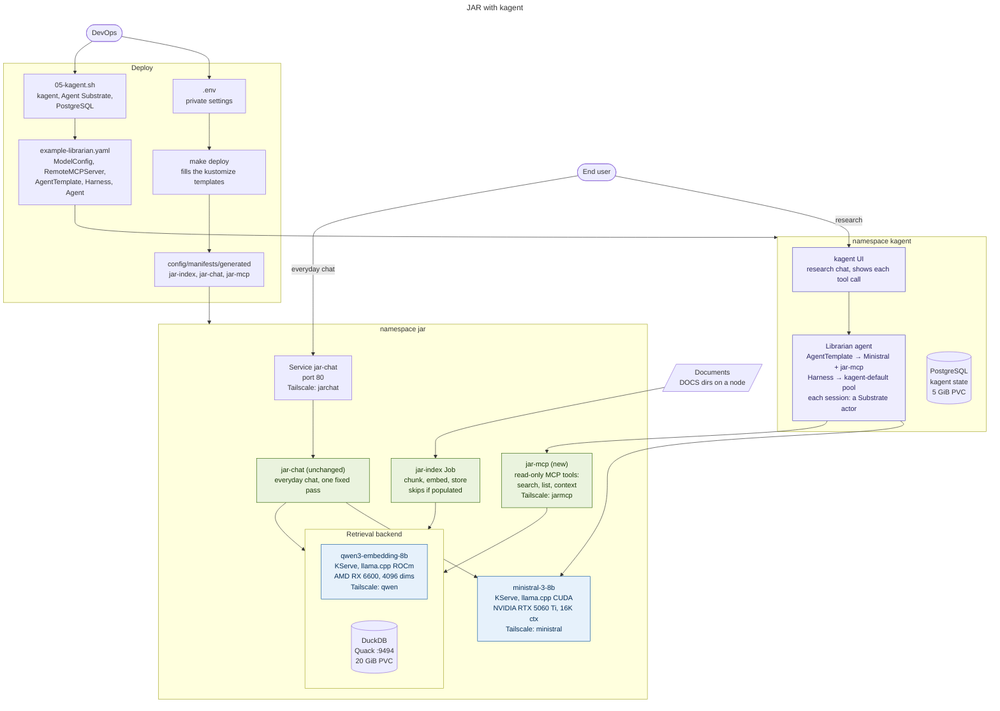

```mermaid
---
title: JAR with kagent
---
flowchart TB
    devops(["DevOps"])
    enduser(["End user"])

    subgraph deploy["Deploy"]
        direction LR
        env[".env<br/>private settings"]
        make["make deploy<br/>fills the kustomize templates"]
        gen["config/manifests/generated<br/>jar-index, jar-chat, jar-mcp"]
        env --> make --> gen
        kagentsh["05-kagent.sh<br/>kagent, Agent Substrate,<br/>PostgreSQL"]
        librarian["example-librarian.yaml<br/>ModelConfig, RemoteMCPServer,<br/>AgentTemplate, Harness, Agent"]
        kagentsh --> librarian
    end

    docs[/"Documents<br/>DOCS dirs on a node"/]

    subgraph nskagent["namespace kagent"]
        direction LR
        ui["kagent UI<br/>research chat, shows each tool call"]:::kagent
        agent["Librarian agent<br/>AgentTemplate → Ministral + jar-mcp<br/>Harness → kagent-default pool<br/>each session: a Substrate actor"]:::kagent
        pg[("PostgreSQL<br/>kagent state<br/>5 GiB PVC")]
        ui --> agent
    end

    subgraph nsjar["namespace jar"]
        svc["Service jar-chat<br/>port 80<br/>Tailscale: jarchat"]
        chat["jar-chat (unchanged)<br/>everyday chat, one fixed pass"]:::jar
        mini["ministral-3-8b<br/>KServe, llama.cpp CUDA<br/>NVIDIA RTX 5060 Ti, 16K ctx<br/>Tailscale: ministral"]:::model
        mcp["jar-mcp (new)<br/>read-only MCP tools:<br/>search, list, context<br/>Tailscale: jarmcp"]:::jar
        idx["jar-index Job<br/>chunk, embed, store<br/>skips if populated"]:::jar
        subgraph backend["Retrieval backend"]
            qwen["qwen3-embedding-8b<br/>KServe, llama.cpp ROCm<br/>AMD RX 6600, 4096 dims<br/>Tailscale: qwen"]:::model
            duck[("DuckDB<br/>Quack :9494<br/>20 GiB PVC")]
        end
    end

    devops --> env
    devops --> kagentsh
    gen --> nsjar
    librarian --> nskagent

    enduser -- research --> ui
    enduser -- everyday chat --> svc

    svc --> chat
    chat --> mini
    chat --> backend

    agent --> mini
    agent --> mcp
    mcp --> backend

    docs --> idx
    idx --> backend

    classDef jar fill:#EAF3DE,stroke:#3B6D11,color:#173404
    classDef model fill:#E6F1FB,stroke:#185FA5,color:#042C53
    classDef kagent fill:#EEEDFE,stroke:#534AB7,color:#26215C
```
